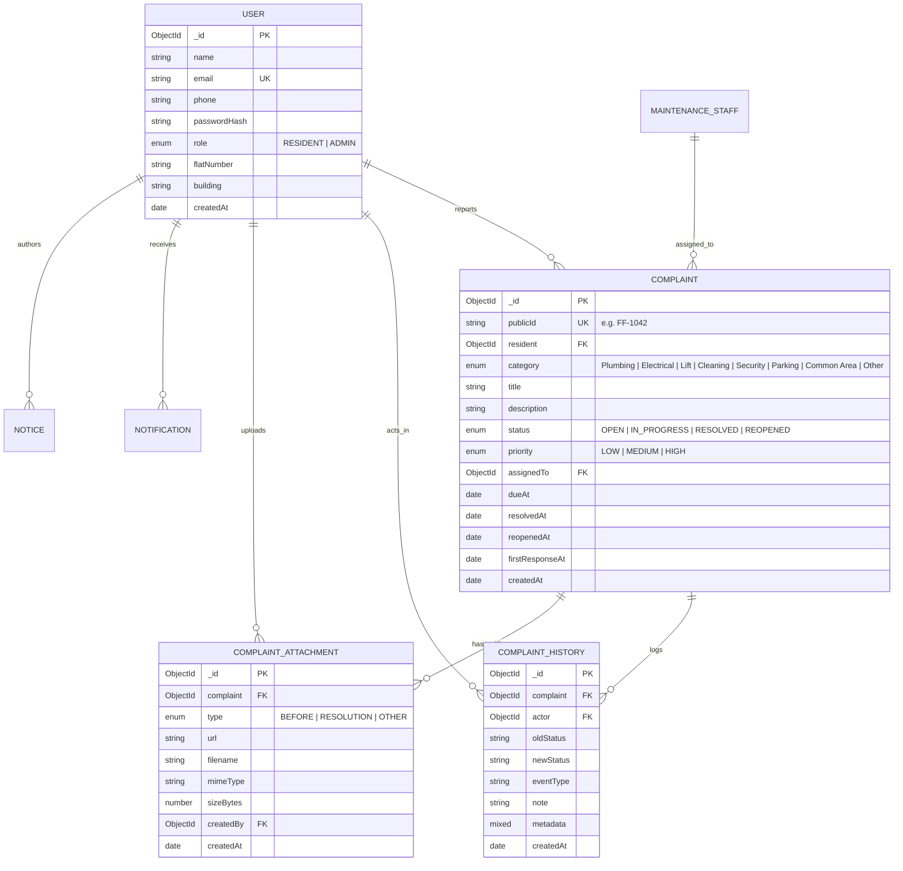

# FixFlow Database Schema Reference

Database: **MongoDB** using **Mongoose ODM**.

## Indexes
- `User`: `{ email: 1 }` (unique)
- `Complaint`: `{ publicId: 1 }` (unique), `{ resident: 1 }`, `{ status: 1, dueAt: 1 }`, `{ category: 1, createdAt: -1 }`
- `ComplaintHistory`: `{ complaint: 1, createdAt: 1 }`
- `Notification`: `{ user: 1, readAt: 1, createdAt: -1 }`
- `Counter`: `{ name: 1 }` (unique)
